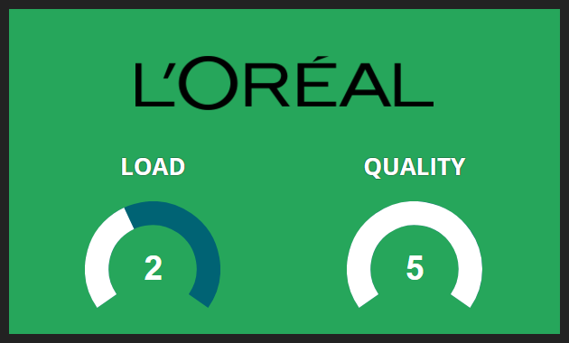

# Description
Fetch and show the current load and quality of a project from a Google Spreadsheet. It is assumed here that you already have a Google Service account and credentials. For more information, check out these links:
* [Sheets API - Ruby Quickstart](https://developers.google.com/sheets/api/quickstart/ruby)
* [OAuth 2.0 for Server to Server Applications](https://developers.google.com/api-client-library/ruby/auth/service-accounts)
* [Google Application Default Credentials](https://developers.google.com/identity/protocols/application-default-credentials)

# Installation
* Install the Google API client: `gem install 'google-api-client'`.
* Create an environment variable called `GOOGLE_APPLICATION_CREDENTIALS` pointing to your Google credentials.
* Add `gem 'google-api-client', :require => 'google/apis'` to `Gemfile` located at the root of your dashing project.
* Move the files to the corresponding folders.

# Usage
Follow these steps to create a new project row in Google Sheet and its associated widget:
1. Make sure `SPREADSHEET_ID` in `project_load.rb` correspond to your [Google Sheet ID](https://developers.google.com/sheets/api/guides/concepts#spreadsheet_id).
2. Add a new row in your Google Sheet:
    * The project row must at least have these properties: ID, Logo, Name, Load and Quality.
    * ID is an unique string that will be used to identify the project's wigdet.
    * To add a logo, select the cell and format it with `=IMAGE("URL")`. The logo should have a transparent background for aesthetic purposes.
3. Change `range` in `project_load.rb` to match your own Google Sheet columns.
4. Add the following code to your dashboard layout file. The arguments are:
    * `data-id`, the project ID defined earlier.
    * `data-logowidth` is optional and can be used to adjust the logo width.
    * `style="background-color:#00A4C0"` is optional and set the widget background to the desired color.
```
<li data-row="1" data-col="1" data-sizex="1" data-sizey="1">
    <div data-id="project-id" data-view="ProjectLoad" data-logowidth="250" style="background-color:#00A4C0"></div>
</li>
```

# Screenshots



